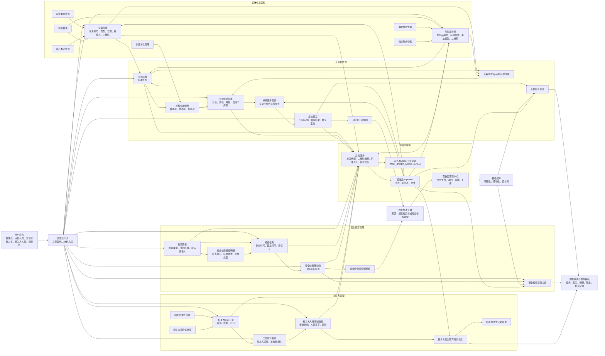

# 点巡检系统全模块总流程图

编写日期：2026-05-11

这张图把系统所有主要模块放在同一张流程图里，适合客户演示开场使用。建议讲解顺序：先从“百数云门户入口”开始，再讲基础数据如何支撑点检、安全检查和相关方培训，最后讲报工、整改和数据追溯。

## 客户讲解主线

1. 系统入口统一在百数云，用户从左侧菜单或二维码进入各业务页面。
2. 基础信息管理提供设备、危化品、场地、类型、事故类型等底层数据。
3. 点检标准定义“检查什么、怎么判定”，点检规则定义“什么时候生成任务”。
4. 点检人员通过扫码报工，系统自动匹配当天任务并记录明细。
5. 安全检查通过模板和任务驱动移动端执行，异常项自动形成隐患整改。
6. 相关方培训通过二维码填报和手写签字，实现培训留痕。
7. 点检异常和安全检查异常统一进入百数云流程中心，形成整改闭环。
8. 所有结果最终沉淀为任务、报工、检查、隐患、培训等可追溯数据。
