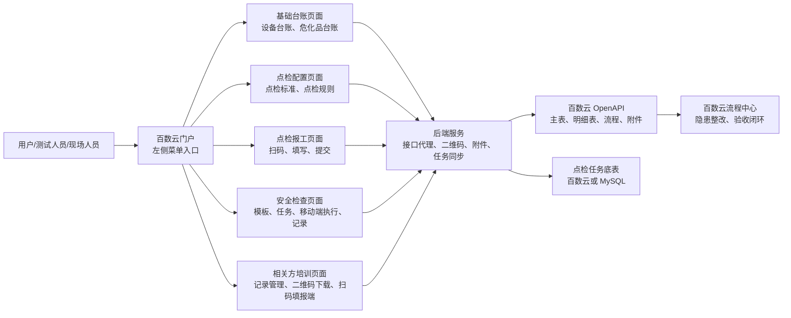
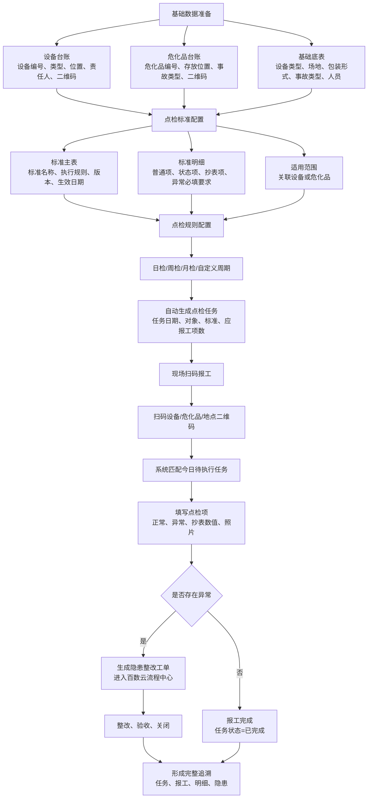
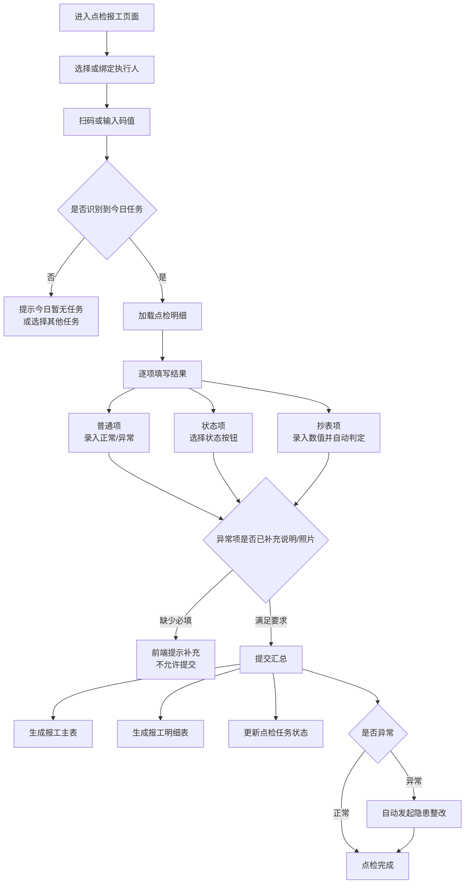
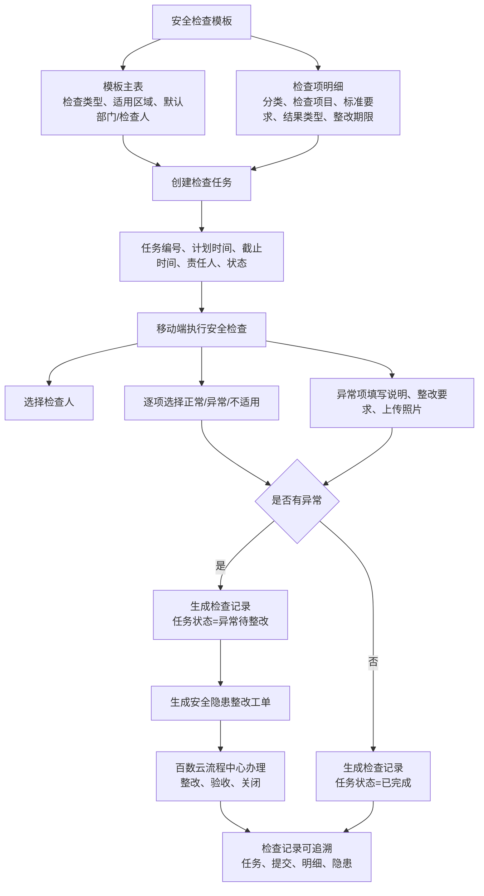
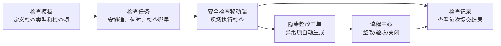
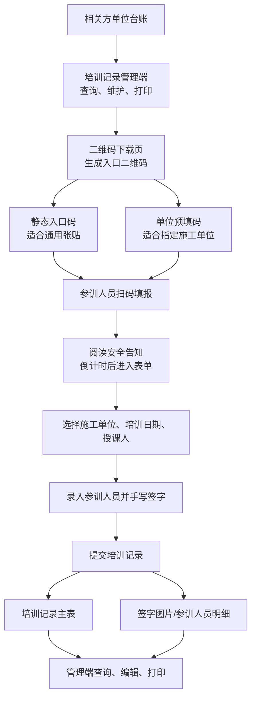
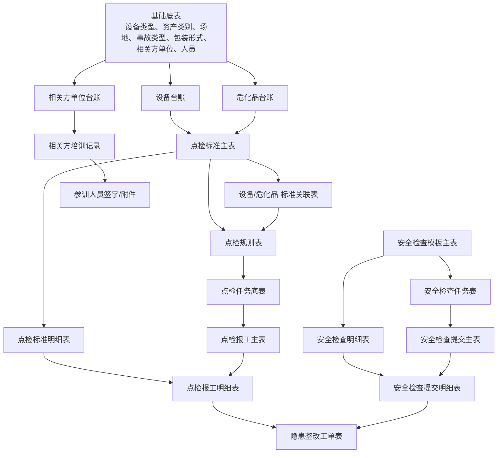
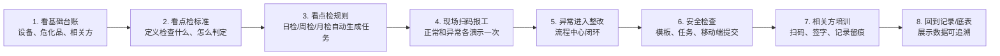

# 点巡检系统流程图

编写日期：2026-05-11

本文档用于客户演示和内部讲解。建议先讲“系统总览”，再按“点检闭环、安全检查闭环、相关方培训闭环、数据关系”展开。

## 1. 系统总览

客户视角可以理解为：百数云负责统一入口、底表和流程，自定义页面负责把现场业务做成更顺手的操作界面，后端服务负责和百数云 OpenAPI、二维码、附件、任务底表打通。

## 2. 点检业务闭环

这一张适合讲“系统为什么能自动生成任务、现场为什么扫码就能报工”。

## 3. 点检报工现场流程

这一张适合给现场主管或一线人员演示。

## 4. 安全检查闭环

安全检查和点检类似，但起点是“检查模板”和“检查任务”，执行端偏移动化。

## 5. 安全检查页面关系

这一张适合解释百数云菜单中的“检查模板、检查任务、检查记录、安全检查”各自做什么。

## 6. 相关方入场培训闭环

这一张适合给客户讲“承包商/外来人员如何扫码培训、签字留痕”。

## 7. 数据关系总览

这张适合给客户说明系统数据怎么串起来，也适合给测试人员理解落库校验点。

## 8. 客户演示推荐讲解顺序

## 9. 演示时可用的话术

- 系统入口在百数云，用户仍然从熟悉的左侧菜单进入，不需要单独记系统地址。
- 设备、危化品、相关方等基础数据是后续任务、报工、培训的源头。
- 点检标准决定“检查什么、怎么判断正常异常”；点检规则决定“什么时候自动生成任务”。
- 现场人员通过扫码进入报工，系统自动匹配当天任务，减少找表和手工录入。
- 一旦发现异常，系统会自动形成隐患整改工单，进入百数云流程中心，实现整改闭环。
- 安全检查模块适合临时或专项检查，移动端执行，异常同样进入整改闭环。
- 相关方培训通过二维码填报和手写签字，形成培训记录和人员签字留痕。
